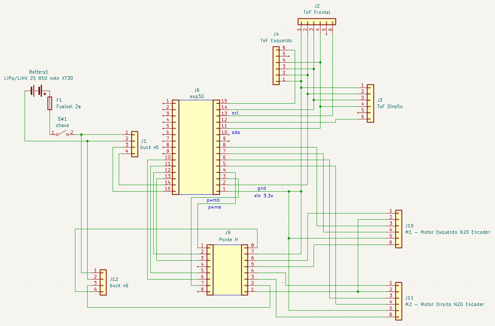

# Diagramas

## Diagrama Esquemático

O esquemático elétrico abaixo representa todas as conexões entre os componentes eletrônicos do micromouse, incluindo alimentação, controle e sensoriamento.

## Diagrama de Blocos
<!--  

-->
---

## Tabela de Versionamento

| Data | Versão | Descrição | Autores |
|------|--------|-----------|---------|
| 09/05/2026 | 0.1 | Criação do documento com esquemático elétrico e legendas técnicas | [Maurício Araújo](https://github.com/mauricio-araujoo) |