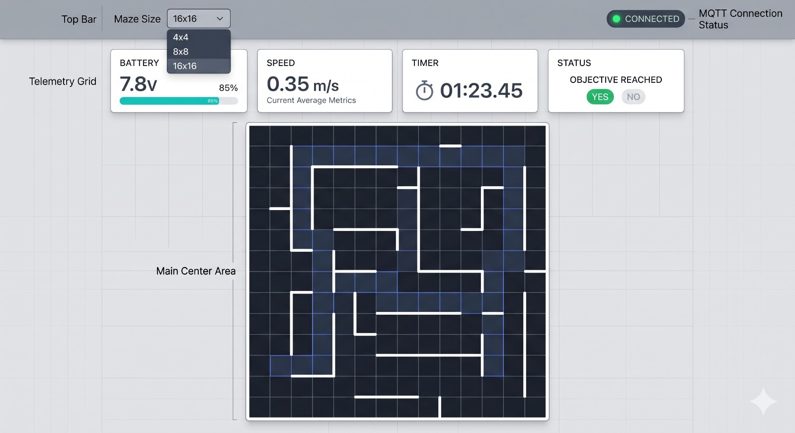

# Stack de Front-end para Telemetria do Micromouse

## Objetivo

Analisar e definir a stack de front-end mais adequada para o sistema web de monitoramento em tempo real do robô Micromouse, comparando:

- atualização em tempo real;
- visualização gráfica do labirinto;
- facilidade de manutenção;
- curva de aprendizado da equipe;
- escalabilidade futura.

## Requisitos do Sistema

O front-end deverá exibir em tempo real:

- Tipo do labirinto
- Trajeto percorrido
- Consumo de bateria
- Velocidade média
- Tempo de conclusão
- Status do desafio (cumprido ou não)

Além disso, o sistema deverá:

- atualizar dados sem recarregar a página;
- representar visualmente o labirinto;
- permitir futura expansão do painel.

# **Opções avaliadas**

**Conjunto 1: HTML5 + CSS3 + JavaScript puro**  
• **Descrição:** Construção da interface usando tecnologias nativas do navegador, sem a adoção de frameworks estruturais.  
• **Vantagens:**  
    ◦ Simples de iniciar.  
    ◦ Sem dependências externas ou processos de *build* complexos.  
    ◦ Menor consumo de recursos de processamento inicial.  
    ◦ Fácil hospedagem em qualquer servidor estático.  
• **Desvantagens:**  
    ◦ Difícil manutenção conforme o sistema do labirinto cresce (especialmente para matrizes de 16x16).  
    ◦ Manipulação manual e repetitiva do DOM para atualizar a telemetria.  
    ◦ O código pode ficar desorganizado rapidamente.  
    ◦ Baixíssima escalabilidade para trabalho em equipe.  

**Conjunto 2: Svelte + CSS Modules + Vite**  
• **Descrição:** Framework moderno que compila o código para JavaScript puro, eliminando a necessidade de um *Virtual DOM*, focado em altíssima performance.  
• **Vantagens:**  
    ◦ Curva de aprendizado suave e sintaxe limpa.  
    ◦ Reatividade nativa extremamente rápida, ideal para telemetria em milissegundos.  
    ◦ Pacote final (*bundle*) muito leve.  
    ◦ Código organizado de forma simples.  
• **Desvantagens:**  
    ◦ Menor adoção acadêmica e no mercado de trabalho.  
    ◦ Comunidade significativamente menor que a do React.  
    ◦ Menos componentes e bibliotecas visuais prontas disponíveis.  

**Conjunto 3: React + Tailwind CSS + Vite**  
• **Descrição:** Biblioteca JavaScript baseada na construção de componentes isolados, combinada com um framework de estilização utilitária para interfaces dinâmicas.  
• **Vantagens:**  
    ◦ Excelente gestão de estados para dados atualizados em tempo real.  
    ◦ Componentização profunda (permite criar "células" isoladas para desenhar o trajeto do robô).  
    ◦ Alta escalabilidade para divisão de tarefas no GitHub.  
    ◦ Grande comunidade e farta documentação técnica.  
    ◦ Fácil manutenção e reutilização de componentes visuais.  
• **Desvantagens:**  
    ◦ Curva inicial de aprendizado maior (exige entendimento de *Hooks* e estados).  
    ◦ Requer configuração de ambiente inicial mais detalhada.  
    ◦ Mais complexo conceitualmente que o JavaScript puro.  

****
| **Critério** | **Conjunto 1 (JS Puro)** | **Conjunto 2 (Svelte Stack)** | **Conjunto 3 (React Stack)** |
| --- | --- | --- | --- |
| **Facilidade inicial** | Alta | Alta | Média |
| **Tempo real (Telemetria)** | Média | Muito Alta | Alta |
| **Escalabilidade (Equipe)** | Baixa | Média | Alta |
| **Manutenção** | Baixa | Alta | Alta |
| **Ecossistema/Comunidade** | Alta | Média | Muito Alta |
****

### **Stack recomendada**

**Tecnologia escolhida:** Conjunto 3 (React + Tailwind CSS + Vite)  

**Justificativa:**  
A escolha deste conjunto em React foi feita porque o projeto visual exige:  

- Atualização contínua e simultânea de diversas métricas na interface (bateria, velocidade, tempo).  
- Visualização dinâmica e em grade do labirinto conforme o robô avança.  
- Separação clara de componentes estruturais, facilitando a divisão de *issues* entre os integrantes da equipe de front-end.  
- Facilidade para expansão do painel (adicionando gráficos históricos nas etapas finais).  

O ecossistema React oferece o suporte mais robusto do mercado para:  

- Renderização condicional eficiente (evitando que o navegador trave com o fluxo contínuo de dados).  
- Criação de dashboards segmentados.  
- Integração nativa com APIs de WebSocket na camada cliente.  

### **Stack Front-end Sugerida**

- **Core da Interface:** React (para componentização e gestão de estados).
- **Build Tool:** Vite (para inicialização rápida do servidor de desenvolvimento).
- **Estilização:** Tailwind CSS (para prototipação ágil do dashboard de telemetria).
- **Renderização Gráfica:** HTML5 Canvas API (integrada ao React para desenhar o trajeto no mapa do labirinto).

### **Previsão simplificada do Fluxo (Client-Side)**

`Recepção de Dados via WebSocket (API do Navegador) → Atualização do Estado Local (React State) → Re-renderização dos Componentes Gráficos (Dashboard e Mapa)`

# Wireframe

