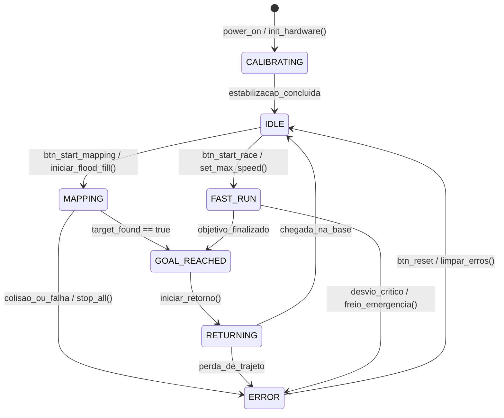
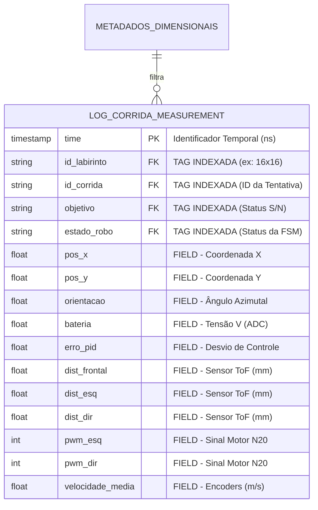

# Definição do Banco de Dados para Histórico de Corridas e Telemetria

Esta documentação detalha a arquitetura de persistência e telemetria para o projeto Micromouse (PI1 - FCTE/UnB), fundamentada no paradigma de séries temporais para suportar as demandas de alta frequência do sistema embarcado.

## 1. Tabela Comparativa de Arquiteturas

Para sustentar o volume de dados de alta frequência gerado pelo Micromouse, avaliamos três modelos de bancos de dados. A escolha considerou latência de escrita, eficiência de armazenamento e facilidade de consulta por labirinto.

| Característica        | InfluxDB (TSDB)                     | PostgreSQL (SQL)                     | Redis (NoSQL)                      |
|----------------------|-------------------------------------|--------------------------------------|-----------------------------------|
| Estrutura            | Séries Temporais (Tags/Fields)       | Tabelas Relacionais Rígidas          | Chave-Valor em Memória            |
| Performance Ingestão | Altíssima (otimizada para IoT)       | Média (índices B-Tree degradam)      | Altíssima (limitada pela RAM)     |
| Consultas Temporais  | Nativas (ex: médias por trecho)      | Requer extensões ou SQL complexo     | Limitadas sem módulos extras      |
| Uso de Disco         | Alta compressão (colunar)            | Baixa compressão para logs           | Alto custo (primariamente RAM)    |
| Veredito             | **Ideal para o projeto** | Ineficiente para alta frequência     | Bom para cache, ruim para histórico |

---

## 2. Escolha Técnica: InfluxDB

A arquitetura recomendada é o **InfluxDB**. Diferente de bancos tradicionais, ele é projetado para o paradigma *append-only*, onde novos dados são inseridos sequencialmente com um carimbo de tempo (*timestamp*).

Como o Micromouse opera com loops de controle PID de até **1kHz**, o banco precisa aceitar rajadas de dados sem bloquear o fluxo de rede. O InfluxDB permite indexar metadados através de **Tags**, o que resolve o requisito de consultas por labirinto de forma instantânea, sem a necessidade de operações custosas como `JOIN`.

---

## 3. Sinergia com C++ e ESP32

A escolha do InfluxDB cria um ecossistema coeso com as decisões de hardware e software já tomadas:

- **Mapeamento Direto:** As structs de telemetria em C++ mapeiam-se diretamente para o formato do banco (Fields e Tags).
- **Processamento Dual-Core:** O ESP32 distribui as tarefas; o Core 0 foca no controle PID enquanto o Core 1 gerencia a transmissão de dados.
- **Eficiência de Banda:** Uso de serialização **MsgPack** (via ArduinoJson) para reduzir o payload, com conversão para **Line Protocol** na estação base.

---

## 4. Diagramas Técnicos

### 4.1 Diagrama de Estados do Robô (UML)
O firmware opera sob estados determinísticos que ditam o ciclo de vida do robô e são persistidos como Tags.

### 4.2 Modelo de Dados de Séries Temporais (Schema Design)
Representação do esquema lógico adaptado para o paradigma de séries temporais.

## 5. Desenho do Esquema de Dados (Schema)
 * **Bucket:** micromouse_telemetria
 * **Measurement:** log_corrida
### Tags (Indexadas — usadas para filtros)
| Tag | Tipo | Descrição | Exemplo |
|---|---|---|---|
| id_labirinto | String | Dimensão do grid de teste | "16x16", "8x8", "4x4" |
| id_corrida | String | Identificador único da tentativa | "run_20260510_1" |
| objetivo | String | Indica se o robô atingiu o centro | "S", "N" |
| estado_robo | String | Estado da FSM no momento da leitura | "MAPPING", "FAST_RUN", "ERROR" |
### Fields (Métricas de tempo real — Não Indexadas)
| Field | Tipo | Descrição / Origem |
|---|---|---|
| pos_x, pos_y | Float | Coordenadas calculadas na matriz do labirinto |
| orientacao | Float | Ângulo azimutal capturado via IMU/Odometria |
| bateria | Float | Tensão instantânea monitorada via ADC1 |
| erro_pid | Float | Valor do desvio instantâneo na malha de controle |
| dist_frontal | Float | Leitura do sensor ToF Frontal (mm) |
| dist_esq | Float | Leitura do sensor ToF Esquerdo (mm) |
| dist_dir | Float | Leitura do sensor ToF Direito (mm) |
| pwm_esq, pwm_dir | Int | Sinal de potência aplicado aos motores N20 |
| velocidade_media | Float | Velocidade linear calculada via encoders (m/s) |
## 6. Estratégia de Comunicação e Resiliência
 * **Transporte:** Comunicação não-bloqueante via **UDP (AsyncUDP)** com latência entre 1-5 ms.
 * **Ingestão:** Serviço em Node.js recebe pacotes UDP, decodifica o MsgPack e converte para InfluxDB Line Protocol.
 * **Resiliência:** Uso de **LittleFS via SDMMC** para armazenamento local contingencial em caso de falha na rede Wi-Fi, com upload posterior.

