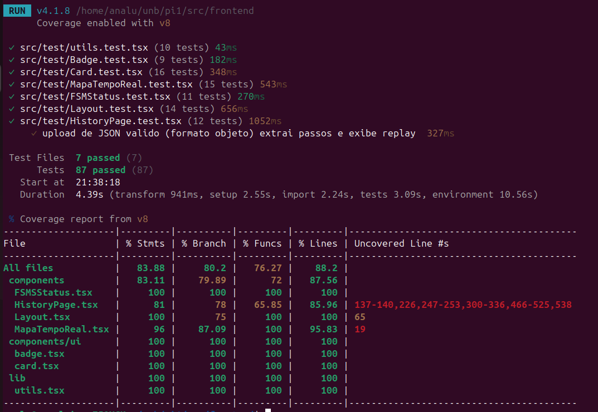
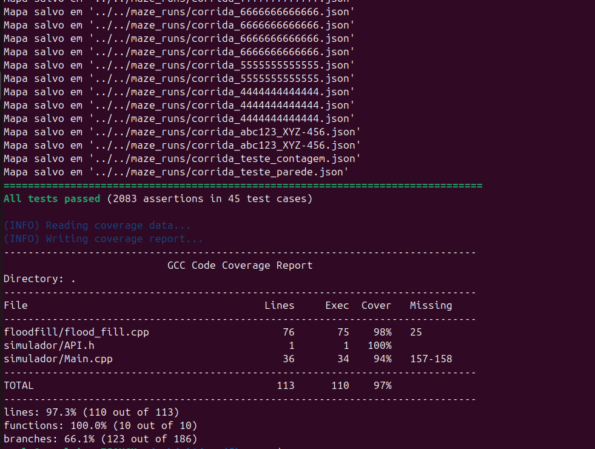

# Testes Unitários

## O que são

Testes unitários verificam o comportamento de **unidades isoladas** de código — funções, componentes React, ou helpers — sem depender de sistemas externos (rede, banco de dados, hardware). São rápidos, determinísticos e rodam em memória.

Neste projeto, os testes unitários estão divididos em duas frentes:

| Camada | Framework | Localização |
|---|---|---|
| **Frontend** (React) | [Vitest](https://vitest.dev/) + [Testing Library](https://testing-library.com/) | `src/frontend/src/test/` |
| **Firmware** (C++) | [Catch2](https://github.com/catchorg/Catch2) v3.7.1 | `src/firmware/__test__/` |

---

## Frontend — Vitest + Testing Library

### Estrutura

```
src/frontend/src/test/
├── setup.ts                  ← Configuração global do Vitest
├── utils.test.tsx            ← Testes da função cn() (merge de classes)
├── Badge.test.tsx            ← Testes do componente Badge (variantes)
├── Card.test.tsx             ← Testes dos componentes Card (Header, Title, Content, Footer, Action)
├── FSMStatus.test.tsx        ← Testes do componente FSMStatus (orientação, erro)
├── Layout.test.tsx           ← Testes do Layout (sidebar, navegação, conexão)
├── MapaTempoReal.test.tsx    ← Testes do RobotMap (grade, rotação, paredes)
└── HistoryPage.test.tsx      ← Testes do HistoryPage (API, replay, upload)
```

### Configuração (`vite.config.ts`)

```ts
test: {
  globals: true,                    // APIs do Vitest globais (describe, it, expect)
  environment: 'jsdom',             // Simula DOM de navegador em Node.js
  setupFiles: ['./src/test/setup.ts'], // Setup global antes de cada arquivo
  css: true,                        // Processa imports de CSS
}
```

### Setup global (`src/test/setup.ts`)

```ts
import '@testing-library/jest-dom/vitest';  // Matchers como toBeInTheDocument()
import { cleanup } from '@testing-library/react';

afterEach(() => {
  cleanup();  // Limpa o DOM após cada teste
});
```

### Dependências

```json
{
  "@testing-library/jest-dom": "^6.9.1",
  "@testing-library/react": "^16.3.2",
  "@testing-library/user-event": "^14.6.1",
  "jsdom": "^29.1.1",
  "msw": "^2.14.6",
  "vitest": "^4.1.8",
  "@vitest/coverage-v8": "^4.1.8"
}
```

### Testes do HistoryPage (`src/test/HistoryPage.test.tsx`)

Testa o componente de visualização de histórico de corridas do robô. Usa **MSW (Mock Service Worker)** para interceptar chamadas HTTP e simular respostas da API.

#### Grupo 1 — Listagem de corridas (`GET /api/maze_runs`)

| Teste | Descrição |
|---|---|
| Retorna array e exibe botões | API retorna lista de arquivos → botões renderizados na tela |
| Lista vazia | API retorna `[]` → mensagem "Nenhuma corrida encontrada" |
| Erro na API (500) | API retorna erro → não crasha, fallback para lista vazia |

#### Grupo 2 — Carregamento de corrida (`GET /api/maze_runs/:arquivo`)

| Teste | Descrição |
|---|---|
| JSON formato objeto | `{id_corrida, historico: [...]}` → passos extraídos e replay exibido |
| JSON formato array | `[{x, y, orientacao, paredes}]` → passos extraídos e replay exibido |
| JSON inválido | Formato não reconhecido → mensagem de erro, sem crash |
| HTTP erro (404) | Arquivo não encontrado → mensagem de erro, sem crash |
| Histórico vazio | `{historico: []}` → mensagem "Histórico vazio" |

#### Grupo 3 — Upload manual de arquivo

| Teste | Descrição |
|---|---|
| Upload JSON objeto | Arquivo com formato `{id_corrida, historico}` → extrai passos e exibe replay |
| Upload JSON array | Arquivo com formato `[...]` → extrai passos e exibe replay |
| Upload JSON quebrado | Sintaxe inválida → mensagem "Erro no arquivo", sem crash |

#### Exemplo de mock MSW

```ts
import { http, HttpResponse } from 'msw';
import { setupServer } from 'msw/node';

const server = setupServer(
  http.get('/api/maze_runs', () => HttpResponse.json(['corrida_01.json'])),
  http.get('/api/maze_runs/corrida_01.json', () =>
    HttpResponse.json({
      id_corrida: 'run_001',
      historico: [
        { x: 0, y: 7, orientacao: 'NORTE', paredes: [] },
        { x: 0, y: 6, orientacao: 'NORTE', paredes: [{ x: 0, y: 6, dir: 'NORTE' }] }
      ]
    })
  )
);

beforeAll(() => server.listen());
afterEach(() => server.resetHandlers());
afterAll(() => server.close());
```

### Como rodar — Frontend

```bash
cd src/frontend

# Rodar todos os testes unitários uma vez
npm test

# Rodar em modo watch (re-executa ao salvar)
npm run test:watch

# Rodar com cobertura
npx vitest run --coverage
```

### Cobertura — Frontend

| Arquivo | Linhas | Statements | Branches | Funções |
|---|---|---|---|---|
| `utils.tsx` | 100% | 100% | 100% | 100% |
| `badge.tsx` | 100% | 100% | 100% | 100% |
| `card.tsx` | 100% | 100% | 100% | 100% |
| `FSMSStatus.tsx` | 100% | 100% | 100% | 100% |
| `Layout.tsx` | 100% | 100% | 75% | 100% |
| `MapaTempoReal.tsx` | 95.83% | 96% | 87.09% | 100% |
| `HistoryPage.tsx` | 85.96% | 81% | 78% | 65.85% |
| **Total** | **88.20%** | **83.88%** | **80.20%** | **76.27%** |

<p align="center">Figura 1 - Cobertura do Frontend</p>



> `Dashboard.tsx` não tem teste unitário pois depende de `socket.io-client` (conexão WebSocket real). É coberto pelos **testes E2E com Playwright**.

---

### Utilitários (`src/test/utils.test.tsx`)

Testa a função `cn()` que combina `clsx` com `tailwind-merge`:

| Teste | Descrição |
|---|---|
| Concatena strings simples | `cn('a', 'b')` → `'a b'` |
| Remove falsy values | `null`, `undefined`, `false` são ignorados |
| Resolve conflitos Tailwind | `cn('p-4', 'p-2')` → `'p-2'` (última vence) |
| Condicionais booleanos | `cn('base', true && 'active')` → inclui; `false && 'x'` → ignora |
| Arrays aninhados | `cn('base', ['nested', ['deep']])` → achata tudo |
| Remove duplicatas | `cn('text-red-500', 'text-blue-500')` → `'text-blue-500'` |
| Sem argumentos | `cn()` → `''` |
| Classes não-Tailwind | Mantidas intactas |
| Objetos (clsx) | `cn('base', { active: true, disabled: false })` → `'base active'` |

### Badge (`src/test/Badge.test.tsx`)

Testa o componente de badge com variantes:

| Variante | Verificação |
|---|---|
| **default** | Classes base (`inline-flex`), sem classes destrutivas |
| **secondary** | Classe `bg-secondary` presente |
| **destructive** | Classe `bg-destructive` presente |
| **outline** | Sem `bg-primary` nem `bg-destructive` |
| **asChild** | Renderiza como filho (`<a>` em vez de `<span>`) |
| **className customizado** | Classes extras mescladas corretamente |
| **data-slot** | Atributo `data-slot="badge"` presente |

### Card (`src/test/Card.test.tsx`)

Testa a família de componentes Card:

| Componente | Testes |
|---|---|
| **Card** | Renderização, `data-slot="card"`, className customizado, classes base (`rounded-xl`, `border`) |
| **CardHeader** | Renderização, `data-slot="card-header"`, className customizado |
| **CardTitle** | Renderiza como `<h4>`, classe `leading-none` |
| **CardDescription** | Renderiza como `<p>` |
| **CardContent** | Renderização, `data-slot="card-content"` |
| **CardFooter** | Renderização, `data-slot="card-footer"` |
| **CardAction** | Renderiza como `<div>` com children |
| **Composição** | Card completo com Header + Title + Description + Action + Content + Footer |

### FSMStatus (`src/test/FSMStatus.test.tsx`)

Testa o card de status de navegação do robô:

| Teste | Descrição |
|---|---|
| Título | "Navegação Interna" visível |
| Orientação | Exibe NORTE, SUL, LESTE, OESTE conforme telemetria |
| Timestamp | Exibe timestamp do último pacote recebido |
| Rótulos | "Bússola (Orientação)" e "Último Pacote Recebido" visíveis |
| Estado ERROR | Borda destrutiva (`border-destructive`), ícone Navigation vermelho |
| Estado normal | Sem classe `border-destructive` |

### Layout (`src/test/Layout.test.tsx`)

Testa a estrutura de navegação principal:

| Grupo | Testes |
|---|---|
| **Identidade** | Nome "Micromouse", versão "Telemetria v1.0", título "Menu" |
| **Navegação** | Links Dashboard (`/`) e Histórico (`/historico`) com hrefs corretos |
| **Rota ativa** | Dashboard ativo em `/`, Histórico ativo em `/historico` (classe `bg-blue-500/20`) |
| **Conexão** | Texto "Conectado", ícone WiFi, indicador de pulso verde |
| **Perfil** | Nome "Admin", avatar com inicial "A" |
| **Outlet** | Elemento `<main>` para conteúdo das rotas filhas |

### MapaTempoReal (`src/test/MapaTempoReal.test.tsx`)

Testa o grid do labirinto em tempo real:

| Grupo | Testes |
|---|---|
| **Grade** | 4×4 = 16 células, 8×8 = 64 células, 16×16 = 256 células |
| **Robô** | Célula com fundo azul (`bg-blue-500/20`) na posição correta |
| **Células exploradas** | Fundo escuro (`#1e293b`), não exploradas = transparente |
| **Rotação** | NORTE=0deg, LESTE=90deg, SUL=180deg, OESTE=-90deg |
| **Trajeto rápido** | Pontos verdes aparecem com `mostrarTrajetoRapido=true`, somem com `false` |
| **Sobreposição** | Ponto verde não aparece sobre a célula do robô |
| **Paredes** | Borda vermelha (`border-t-red-500`) na direção correta; sem paredes = sem bordas vermelhas |

### HistoryPage (`src/test/HistoryPage.test.tsx`)

Testa o componente de visualização de histórico de corridas do robô. Usa **MSW (Mock Service Worker)** para interceptar chamadas HTTP e simular respostas da API.

### Estrutura

```
src/firmware/__test__/
├── API_mock.h                  ← Mock do hardware (sensores, motores, labirinto)
├── test_ff_helpers.cpp         ← Testes das funções auxiliares do Flood Fill
├── test_ff_inicializar.cpp     ← Testes da inicialização do Flood Fill
├── test_flood_fill.cpp         ← Testes da função de registrar paredes
├── test_salva_json.cpp         ← Testes da exportação JSON
└── test_main_exploracao.cpp    ← Testes do algoritmo de exploração (integração)
```

### Mock de Hardware (`API_mock.h`)

Como os testes rodam sem o hardware físico (ESP32, sensores VL53L0X, motores), um mock completo simula:

- **Labirinto** (`MockLabirinto`): grade 2D com posição e orientação do robô
- **Sensores**: `wallFront()`, `wallRight()`, `wallLeft()`
- **Atuadores**: `moveForward()`, `turnRight()`, `turnLeft()`
- **Paredes bidirecionais**: ao adicionar parede em uma célula, a face oposta da vizinha também é atualizada
- **Limite de segurança**: 512 passos máximos para evitar loops infinitos

### Testes de Helpers (`test_ff_helpers.cpp`)

Testa funções `dentro_limite()` e `passavel()`:

| Função | Casos de teste |
|---|---|
| `dentro_limite(x, y)` | Cantos (0,0) e (MAX-1,MAX-1), células internas, coordenadas negativas, fora da grade |
| `passavel(celula, direcao)` | Sem parede → true; com parede em NORTE, SUL, LESTE, OESTE → false |

### Testes de Inicialização (`test_ff_inicializar.cpp`)

Testa `ff_inicializar()` em múltiplos tamanhos de grade (4×4, 8×8, 16×16):

| Verificação | Descrição |
|---|---|
| Paredes externas | Presentes nos 4 bordos da grade |
| Células internas | Sem paredes após init |
| Células objetivo | Distância = 0 |
| Distâncias BFS | Todas as células têm distância > 0 e < 255 |
| Sem infinitos | Nenhuma célula com valor 255 (inalcançável) |

### Testes de Paredes (`test_flood_fill.cpp`)

Testa `ff_parede()`:

| Verificação | Descrição |
|---|---|
| Paredes direcionais | NORTE, SUL, LESTE, OESTE registram na origem |
| Espelhamento | Parede na origem → face oposta na célula vizinha |
| Independência | Parede em uma direção não afeta outras direções |
| Bordas | Sem segfault ao manipular paredes na borda da grade |
| Múltiplas paredes | Até 4 direções na mesma célula |

### Testes de Exportação JSON (`test_salva_json.cpp`)

Testa `salva_json()`:

| Verificação | Descrição |
|---|---|
| Criação do arquivo | Arquivo criado em `maze_runs/` |
| Sintaxe JSON | Abre com `{`, fecha com `}` |
| Campos obrigatórios | `id_corrida`, `historico`, `x`, `y`, `orientacao`, `paredes`, `dir` |
| Precisão dos dados | `id_corrida` não vazio, `historico` é array |
| Passos corretos | Cada passo contém x, y, orientacao, paredes |
| Casos extremos | Histórico vazio gera JSON válido; caracteres especiais no ID |
| Contagem | Número de passos no JSON = steps da exploração |

### Como rodar — Firmware

```bash
cd src/firmware

# Configurar build de teste (primeira vez)
mkdir -p build_test && cd build_test
cmake ../__test__

# Compilar e rodar os testes
make -j$(nproc) && ./test_floodfill

# Rodar com CTest (alternativa)
ctest --output-on-failure

# Rodar um teste específico
ctest -R flood_fill --output-on-failure
```

### Cobertura — Firmware

Para gerar relatório de cobertura com `gcovr`, adicione os flags `--coverage` na configuração:

```bash
cd src/firmware

# 1. Configurar build com coverage (uma vez)
mkdir -p build_test && cd build_test
cmake ../__test__ \
  -DCMAKE_BUILD_TYPE=Debug \
  -DCMAKE_CXX_FLAGS="--coverage" \
  -DCMAKE_EXE_LINKER_FLAGS="--coverage"

# 2. Compilar e rodar os testes
make -j$(nproc) && ./test_floodfill

# 3. Gerar relatório (de volta em src/firmware/)
cd ..
~/.local/bin/gcovr \
  --object-directory build_test/CMakeFiles/test_floodfill.dir \
  --root . \
  --filter 'floodfill/' \
  --filter 'simulador/' \
  --gcov-ignore-errors=no_working_dir_found \
  --print-summary
```

**Relatório de cobertura do firmware:**


| Arquivo | Linhas | Executadas | Cobertura | Não coberto |
|---|---|---|---|---|
| `floodfill/flood_fill.cpp` | 76 | 75 | 98% | linha 25 |
| `simulador/API.h` | 1 | 1 | 100% | — |
| `simulador/Main.cpp` | 36 | 34 | 94% | linhas 157-158 |
| **Total** | **113** | **110** | **97%** | |

<p align="center">Figura 2 - Cobertura do Firmware</p>



> **45 testes, 2083 assertions.** O branch coverage é 66% — esperado para algoritmo de flood fill com muitos `if/else` de direções (N/S/L/O) não exaustivamente combinados.

---

## Resumo — Como rodar tudo

```bash
# Frontend (Vitest) — 87 testes
cd src/frontend && npm test

# Frontend com cobertura
cd src/frontend && npx vitest run --coverage

# Firmware (Catch2) — 45 testes
cd src/firmware/build_test && ./test_floodfill

# Firmware com cobertura
cd src/firmware
mkdir -p build_test && cd build_test
cmake ../__test__ -DCMAKE_CXX_FLAGS="--coverage" -DCMAKE_EXE_LINKER_FLAGS="--coverage"
make -j$(nproc) && ./test_floodfill
cd .. && ~/.local/bin/gcovr \
  --object-directory build_test/CMakeFiles/test_floodfill.dir \
  --root . --filter 'floodfill/' --filter 'simulador/' \
  --gcov-ignore-errors=no_working_dir_found --print-summary
```

## Resumo de cobertura

| Camada | Framework | Testes | Cobertura (linhas) |
|---|---|---|---|
| **Frontend** | Vitest + Testing Library | 87 | 88% |
| **Firmware** | Catch2 | 45 (2083 assertions) | 97% |
